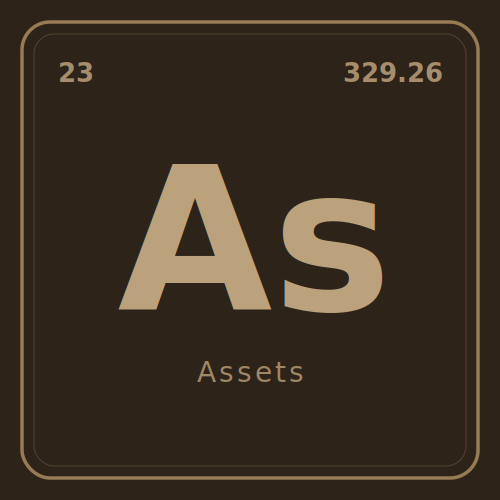

<p align="center">
  <a href="https://github.com/CascadingLabs/Assets">
    <picture>
      <source media="(prefers-color-scheme: dark)" srcset="media/logo-dark.svg">
      <source media="(prefers-color-scheme: light)" srcset="media/logo-light.svg">
      
    </picture>
  </a>
</p>

<p align="center">
  <a href="https://discord.gg/c8MKEaWEEK"></a>
  <a href="https://opensource.org/licenses/Apache-2.0"></a>
</p>

# Cascading Labs Brand Assets

Visual identity assets for Cascading Labs and its projects: **QScrape**, **Yosoi**, **VoidCrawl**, **Assets**, **Yosoi Docs**, and **VoidCrawl Docs**.

## Design system

Every logo follows a **periodic table element tile** motif: a rounded rectangle with a double border, an element symbol at center, and metadata at the corners.

### Anatomy of a tile

```
┌──────────────────────────┐
│  ┌────────────────────┐  │  ← double border (bright outer, faint inner)
│  │ 404          310.26│  │
│  │                    │  │
│  │        Qs          │  │  ← element symbol, centered
│  │                    │  │
│  │      QScrape       │  │  ← project name, centered below symbol
│  └────────────────────┘  │
└──────────────────────────┘
```

| Position | Content | Meaning |
|---|---|---|
| Top-left | Atomic number | A project-specific identifier. QScrape uses **404** (HTTP 404, the scraper's natural enemy). Cascading Labs uses **0** (the origin). Yosoi uses **3** (nod to the escalation tiers). VoidCrawl uses **401** (HTTP 401 Unauthorized). Assets uses **23**. Docs projects share the parent's number. |
| Top-right | Float value | A version or build signature rendered as a decimal. Cascading Labs: **24.26**, QScrape: **310.26**, Yosoi: **812.25**, VoidCrawl: **330.26**, Assets: **329.26**. Docs projects share the parent's float. |
| Center | Symbol | One or two characters from the project name, styled like a chemical symbol (leading uppercase, optional lowercase). **Cl** = Cascading Labs, **Qs** = QScrape, **Ys** = Yosoi, **Vc** = VoidCrawl, **As** = Assets, **Yd** = Yosoi Docs, **Vd** = VoidCrawl Docs. |
| Below center | Name | The full project name in regular weight. |

### Double border

The outer border is bright and solid (3.5 px stroke). The inner border is inset by 12 px, thinner (1 px), and drawn at 35% opacity. This adds depth without visual noise.

Each project also has a `no-lines/` subdirectory with the same color and monochrome variants but without the double border. These are useful for contexts where the tile border feels too heavy (favicons, small avatars, embedded UI).

### Typography

**Font:** [Inter](https://rsms.me/inter/), loaded via Google Fonts `@import` in SVGs. The font stack falls back to `system-ui, sans-serif` for headless rendering.

| Element | Weight | Size |
|---|---|---|
| Symbol | 800 (ExtraBold) | 200 |
| Atomic number / float | 700 (Bold) | 26 |
| Project name | 400 (Regular) | 28 |

All text is horizontally centered (`text-anchor="middle"`) except the atomic number (left-aligned) and the float (right-aligned via `text-anchor="end"`).

### Color palettes

Each project has its own background + accent pair. Borders use a mid-tone between the two.

| Project | Background | Accent | Border |
|---|---|---|---|
| Cascading Labs | monochrome only | `#ffffff` / `#000000` | `#ffffff` / `#000000` |
| QScrape | `#1a0808` | `#ef6464` | `#c94040` |
| Yosoi | `#2e3742` | `#c4d4df` | `#8fa3b3` |
| VoidCrawl | `#120a24` | `#b07adf` | `#7c4dbd` |
| Assets | `#2e2319` | `#c4a882` | `#c4a882` |
| Yosoi Docs | `#2e2319` | `#c4a882` | `#c4a882` |
| VoidCrawl Docs | `#2e2319` | `#c4a882` | `#c4a882` |

Cascading Labs uses monochrome variants only (no colored versions). Assets, Yosoi Docs, and VoidCrawl Docs share a cardboard/peach utility palette. Light-mode variants invert the relationship: pale tinted background with dark accent text. Monochrome variants use pure black (`#141414`) or off-white (`#f5f5f5`) backgrounds with white or black foregrounds.

## File structure

```
Assets/
├── global.css              ← canonical brand design tokens (all projects)
├── cascading-labs/                      ← monochrome only
│   ├── mono-dark/logo.{svg,png,jpg}, favicon.ico
│   ├── mono-light/logo.{svg,png,jpg}, favicon.ico
│   └── no-lines/
│       ├── mono-dark/logo.{svg,png,jpg}, favicon.ico
│       └── mono-light/logo.{svg,png,jpg}, favicon.ico
├── qscrape/
│   └── (full structure: dark, light, mono-dark, mono-light + no-lines)
├── yosoi/
│   └── (same structure)
├── voidcrawl/
│   └── (same structure)
├── assets/                              ← utility palette (cardboard/peach)
│   └── (full structure)
├── yosoi-docs/                          ← utility palette, symbol Yd
│   └── (full structure)
├── voidcrawl-docs/                      ← utility palette, symbol Vd
│   └── (full structure)
├── qr-codes/
│   ├── gen_qr.py             ← QR code generator script
│   ├── cascadinglabs/        ← mono variants only
│   │   ├── cascadinglabs-{mono-dark,mono-light}.{svg,png}
│   │   ├── discord/discord-{mono-dark,mono-light}.{svg,png}
│   │   └── github/github-{mono-dark,mono-light}.{svg,png}
│   ├── qscrape/
│   │   ├── qscrape.{svg,png} (4 variants)
│   │   ├── discord/discord.{svg,png}
│   │   └── github/github.{svg,png}
│   ├── yosoi/
│   │   └── (same structure)
│   ├── voidcrawl/
│   │   └── (same structure)
│   ├── assets/
│   │   ├── assets.{svg,png} (4 variants)
│   │   └── github/github.{svg,png}
│   ├── yosoi-docs/
│   │   ├── yosoi-docs.{svg,png} (4 variants)
│   │   ├── github/github.{svg,png}
│   │   └── discord/discord.{svg,png}
│   └── voidcrawl-docs/
│       ├── voidcrawl-docs.{svg,png} (4 variants)
│       ├── github/github.{svg,png}
│       └── discord/discord.{svg,png}
├── third-party/
│   ├── discord.svg           ← simple-icons source
│   └── github.svg
├── pyproject.toml
└── uv.lock
```

## Links

URLs encoded in the QR codes.

| Project | Site | GitHub | Discord |
|---|---|---|---|
| Cascading Labs | https://cascadinglabs.com | https://github.com/CascadingLabs | https://discord.gg/w6bVujKphH |
| QScrape | https://qscrape.dev | https://github.com/CascadingLabs/QScrape | https://discord.gg/5WZNzFZtgb |
| Yosoi | https://cascadinglabs.com/yosoi | https://github.com/CascadingLabs/Yosoi | https://discord.gg/YreV3CzxsE |
| VoidCrawl | https://cascadinglabs.com/voidcrawl/ | https://github.com/CascadingLabs/VoidCrawl | https://discord.gg/ftykDhmAQN |
| Assets | — | https://github.com/CascadingLabs/Assets | — |
| Yosoi Docs | — | https://github.com/CascadingLabs/YosoiDocs | https://discord.gg/c8MKEaWEEK |
| VoidCrawl Docs | — | https://github.com/CascadingLabs/VoidCrawlDocs | https://discord.gg/c8MKEaWEEK |

## Reproduction steps

### Prerequisites

- [uv](https://docs.astral.sh/uv/) (Python package manager)
- [Inkscape](https://inkscape.org/) (SVG rasterizer, CLI)
- [ImageMagick](https://imagemagick.org/) (`magick` command)
- [librsvg](https://wiki.gnome.org/Projects/LibRsvg) (`rsvg-convert` command, used by `gen_qr.py`)
- Optionally, the **Inter** font installed locally (`pacman -S inter-font` on Arch) for pixel-perfect PNG exports. Without it, Inkscape falls back to the system sans-serif.

### 1. Export logos from SVG to PNG and JPG

Each project directory contains SVG source files. To re-export all raster variants at 512x512:

```bash
cd Assets

# Cascading Labs — mono only
for scheme in mono-dark mono-light; do
  for dir in cascading-labs/$scheme cascading-labs/no-lines/$scheme; do
    svg="$dir/logo.svg"
    [ -f "$svg" ] || continue
    inkscape "$svg" \
      --export-type=png \
      --export-filename="$dir/logo.png" \
      --export-width=512 --export-height=512
    magick "$dir/logo.png" -quality 90 "$dir/logo.jpg"
    magick "$dir/logo.png" -resize 256x256 \
      -define icon:auto-resize=256,128,64,48,32,16 "$dir/favicon.ico"
  done
done

# All other projects — full color + mono variants
for project in qscrape yosoi voidcrawl assets yosoi-docs voidcrawl-docs; do
  for scheme in dark light mono-dark mono-light; do
    svg="$project/$scheme/logo.svg"
    [ -f "$svg" ] || continue
    inkscape "$svg" \
      --export-type=png \
      --export-filename="$project/$scheme/logo.png" \
      --export-width=512 --export-height=512
    magick "$project/$scheme/logo.png" -quality 90 "$project/$scheme/logo.jpg"
    magick "$project/$scheme/logo.png" -resize 256x256 \
      -define icon:auto-resize=256,128,64,48,32,16 "$project/$scheme/favicon.ico"
  done
  # no-lines variants
  for scheme in dark light mono-dark mono-light; do
    svg="$project/no-lines/$scheme/logo.svg"
    [ -f "$svg" ] || continue
    inkscape "$svg" \
      --export-type=png \
      --export-filename="$project/no-lines/$scheme/logo.png" \
      --export-width=512 --export-height=512
    magick "$project/no-lines/$scheme/logo.png" -quality 90 "$project/no-lines/$scheme/logo.jpg"
    magick "$project/no-lines/$scheme/logo.png" -resize 256x256 \
      -define icon:auto-resize=256,128,64,48,32,16 "$project/no-lines/$scheme/favicon.ico"
  done
done
```

### 2. Regenerate QR codes

QR codes embed the project logo at center using `segno` (error correction level H, 30% capacity) with `pillow` for the overlay. The generator uses brand colors from the palette table above.

```bash
cd Assets/qr-codes
uv run gen_qr.py
```

This produces PNG + SVG pairs in per-project subdirectories, each with 4 color variants (dark, light, mono-dark, mono-light). QR codes use dot-style data modules, rounded squircle finder patterns, and concentric circle alignment markers.

### 3. Add or modify a logo

1. Edit the SVG source directly. All logos follow the same template structure (see `qscrape/logo.svg` as reference).
2. Re-run the export loop from step 1 for that project.
3. Re-run `gen_qr.py` from step 2 if the default logo (`logo.png`) changed, since QR codes embed it.

### SVG template

To create a new project logo, copy this template and fill in the values:

```xml
<svg width="100%" viewBox="0 0 500 500" xmlns="http://www.w3.org/2000/svg">
  <defs>
    <style>
      @import url('https://fonts.googleapis.com/css2?family=Inter:wght@400;700;800&amp;display=swap');
    </style>
  </defs>

  <rect x="0" y="0" width="500" height="500" fill="BACKGROUND"/>

  <rect x="22" y="22" width="456" height="456" rx="28"
    fill="none" stroke="BORDER" stroke-width="3.5"/>
  <rect x="34" y="34" width="432" height="432" rx="20"
    fill="none" stroke="BORDER" stroke-width="1" opacity="0.35"/>

  <text x="58" y="82" font-family="Inter, system-ui, sans-serif"
    font-size="26" font-weight="700" fill="ACCENT" opacity="0.8"
  >NUMBER</text>

  <text x="442" y="82" font-family="Inter, system-ui, sans-serif"
    font-size="26" font-weight="700" fill="ACCENT" opacity="0.8"
    text-anchor="end"
  >FLOAT</text>

  <text x="250" y="310" font-family="Inter, system-ui, sans-serif"
    font-size="200" font-weight="800" fill="ACCENT" opacity="0.95"
    text-anchor="middle"
  >SYMBOL</text>

  <text x="250" y="382" font-family="Inter, system-ui, sans-serif"
    font-size="28" font-weight="400" fill="ACCENT" opacity="0.75"
    text-anchor="middle" letter-spacing="3"
  >PROJECT NAME</text>
</svg>
```

Replace `BACKGROUND`, `BORDER`, `ACCENT`, `NUMBER`, `FLOAT`, `SYMBOL`, and `PROJECT NAME` with your values.
